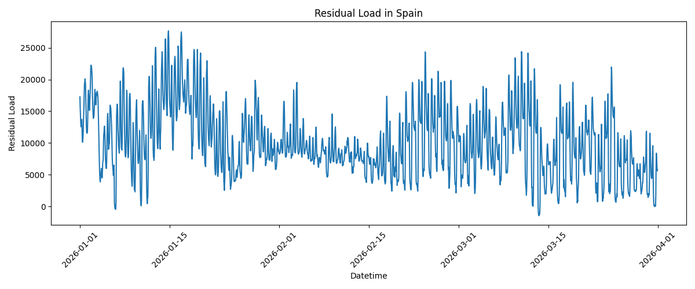
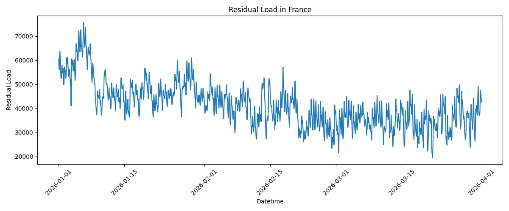
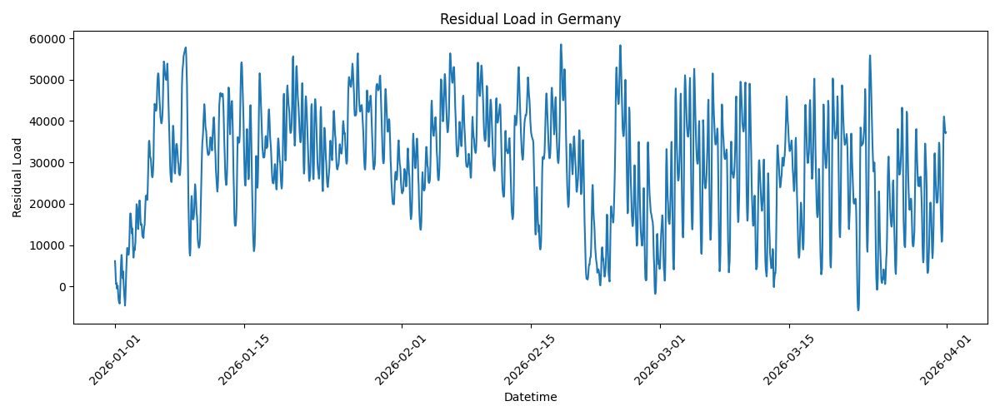
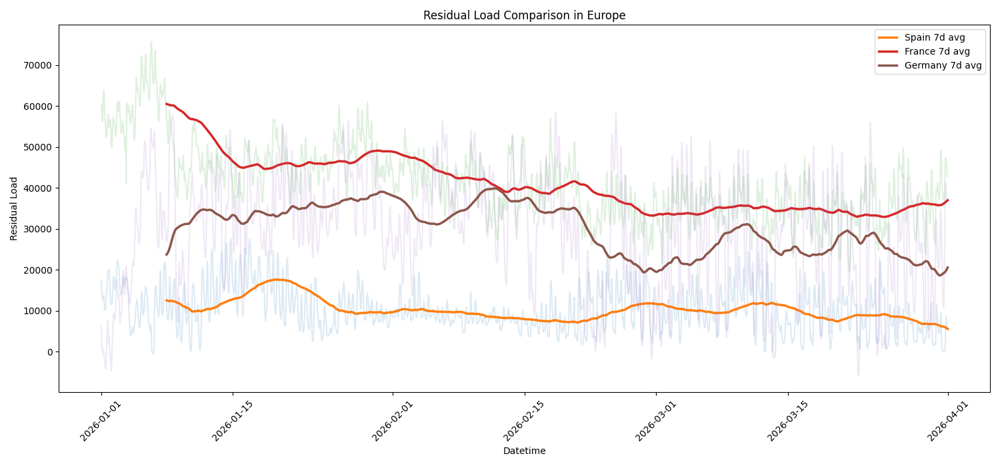

# Residual Load Analysis in European Electricity Markets

## Overview

This project analyzes the residual load of three European electricity markets:

- Spain (ES)
- France (FR)
- Germany (DE)

using hourly electricity data from the Electricity Maps API over a three-month period from January 2026 to April 2026.

The objective of this analysis is to evaluate renewable energy penetration and understand its influence on electricity demand and system flexibility across European electricity systems.

---

# Methodology

Two datasets were collected for each country:

1. Total electricity load
2. Electricity generation mix

The following renewable sources were included in the analysis:

- Solar
- Wind
- Hydro

Renewable generation was calculated as:
renewable_generation = solar + wind + hydro
Residual load was then calculated as:
residual_load = total_load - renewable_generation

Residual load represents the electricity demand that must still be supplied by dispatchable or non-renewable energy sources.

To improve visualization and trend analysis, a 7-day rolling average was added to the comparison plot. This helps smooth short-term fluctuations and highlights medium-term trends.

---

# Residual Load Statistics

| Country | Average Residual Load | Maximum Residual Load | Minimum Residual Load | Standard Deviation |
| ------- | --------------------: | --------------------: | --------------------: | -----------------: |
| Spain   |              10142.18 |              27671.63 |              -1457.14 |            5330.85 |
| France  |              41329.35 |              75707.49 |              19582.06 |            9142.97 |
| Germany |              29205.99 |              58530.82 |              -5806.79 |           13600.27 |

---

# Residual Load in Spain

Spain exhibits the lowest average residual load among the three countries. This result reflects the strong contribution of renewable generation, particularly solar power.

The graph also shows significant daily oscillations caused by the solar production cycle. During periods of high renewable generation, the residual load approaches zero and occasionally becomes negative, indicating renewable overproduction.

Spain’s relatively low standard deviation suggests lower variability compared to Germany.

---

# Residual Load in France

France presents the highest average residual load. This behavior is mainly explained by the large contribution of nuclear generation rather than variable renewable energy sources.

The residual load profile is relatively stable over time compared to Germany. Although fluctuations exist, France maintains a more consistent electricity system balance.

The graph indicates a gradual decline in residual load during the analyzed period, suggesting increasing renewable contribution or lower electricity demand toward spring months.

---

# Residual Load in Germany

Germany shows the highest variability in residual load, reflected by the largest standard deviation among the three countries.

This behavior is strongly associated with Germany’s high penetration of intermittent renewable generation, especially wind energy.

The graph demonstrates large fluctuations, including periods where residual load becomes negative. These events occur when renewable production exceeds electricity demand, highlighting both the opportunities and balancing challenges of highly renewable electricity systems.

---

# Residual Load Comparison

The comparison plot combines all three countries in a single figure.

The transparent lines represent hourly residual load values, while the highlighted curves correspond to the 7-day rolling averages.

Several important observations can be made:

* France maintains the highest residual load throughout most of the period.
* Spain consistently exhibits the lowest residual load due to strong renewable penetration.
* Germany shows the largest volatility and strongest fluctuations.
* The rolling averages reveal long-term trends more clearly than raw hourly data.

The use of rolling averages significantly improves readability and allows better comparison between electricity systems.

---

# Key Insights

* Higher renewable penetration generally reduces residual load.
* Solar generation strongly decreases daytime residual load in Spain.
* Wind generation introduces high short-term variability, especially in Germany.
* France maintains the most stable residual load profile due to nuclear generation.
* Germany experiences the greatest balancing challenges because of intermittent renewable generation.
* Negative residual load periods indicate renewable overproduction and potential curtailment or export opportunities.

---

# Conclusion

This analysis demonstrates the important impact of renewable generation on European electricity markets.

Residual load is a key indicator for understanding:

* renewable integration,
* electricity system flexibility,
* balancing requirements,
* and energy transition challenges.

The results highlight the increasing importance of:

* flexible generation technologies,
* energy storage systems,
* interconnections,
* and demand-side management

in future highly renewable electricity systems.